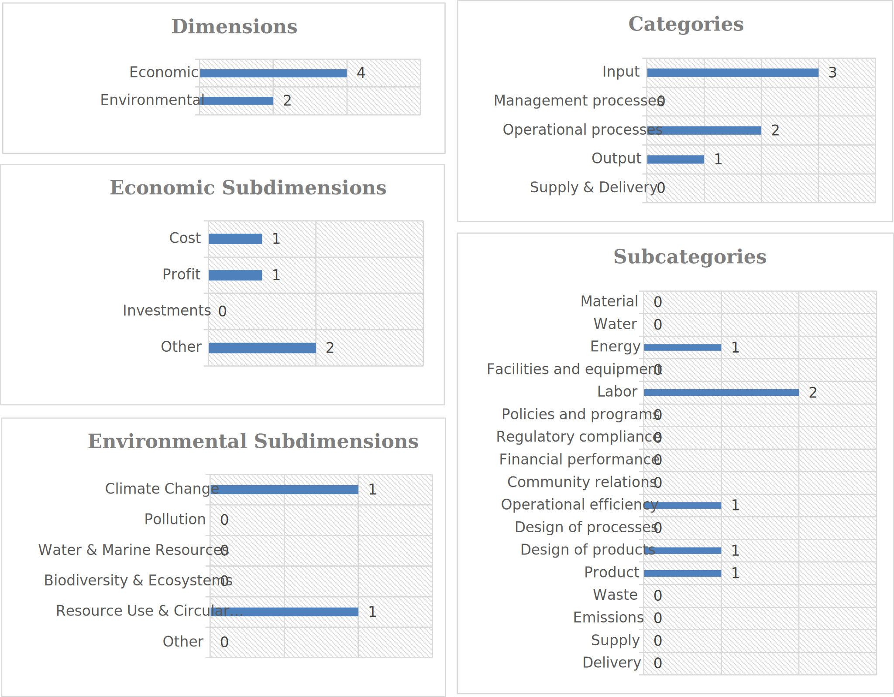

# Indicator Selection Methodology
This document describes the systematic process used to select the six key performance indicators (IND01-IND06) for evaluating disassembly scenarios in this framework.

> **🔬 Research software notice**: This document is part of a research prototype (v2025.11) and serves as implementation guidance. Scientific references are included for contextual understanding and further reading only. The peer-reviewed scientific contribution can only be found in the published article.

## Table of Contents

- [1. Introduction](#1-introduction)
- [2. Five-Step Selection Process](#2-five-step-selection-process)
- [3. Selected Indicators](#3-selected-indicators)
- [References](#references)

 

---

 

## 1. Introduction
The indicator selection process was supported by the **Sustainability KPI Selection Tool** (sus-kpi-sel), a structured decision support framework available at https://github.com/iwb/sus-kpi-sel. The tool was used to systematically identify and evaluate performance indicators for assessing disassembly scenarios.

The selected indicators are configured in [`config/config_indicators.json`](../data/config/config_indicators.json) and documented in [`experiment-configuration.md`](experiment-configuration.md). The selection process resulted in six key performance indicators balancing economic and environmental objectives:

- Environmental indicators: IND01 (Electricity consumption), IND06 (Circularity index)
- Economic indicators: IND02 (Utilization rate), IND03 (Labor cost), IND04 (Lead time), IND05 (Production output)

 

---

 

## 2. Five-Step Selection Process

### 2.1 Scope Definition and Use Case Filtering (Steps 1 & 2)
The scope was defined based on the use case described in section 1 of [`experiment-configuration.md`](experiment-configuration.md#1-use-case-description). It was defined at the factory level, and the selection process was filtered based on the specific use case parameters shown in Table 2.1. These parameters ensure that the selected indicators are relevant to the automotive disassembly context and the operational scale of the target manufacturing environment.

**Table 2.1.** Scope definition and use case filtering parameters

| Parameter | Value |
|-----------|-------|
| Hierarchical Level | Factory |
| Industry | 29 Manufacture of motor vehicles, trailers and semi-trailers |
| Process Type | Separating |
| Company Size | Micro |

### 2.2 Filtered List Review and Selection (Step 3)
According to the scope and filtering criteria that were previously defined, the tool generated a filtered list of 24 candidate indicators. The proposed indicators were reviewed and evaluated based on their relevance, data availability, and comprehensibility for the disassembly scenario assessment. This review led to the selection of three core indicators, as outlined in table 2.2.

**Table 2.2.** Selected indicators from the filtered list

<table>
  <thead>
    <tr>
      <th width="8%">ID</th>
      <th width="18%">Name</th>
      <th width="12%">Category</th>
      <th width="18%">Subdimension</th>
      <th width="38%">Definition</th>
      <th width="6%">Unit</th>
    </tr>
  </thead>
  <tbody>
    <tr>
      <td><strong>13-002</strong></td>
      <td>Electricity consumption</td>
      <td>Environmental</td>
      <td>Climate change</td>
      <td>Measures the total electricity consumption</td>
      <td>kWh</td>
    </tr>
    <tr>
      <td><strong>15-003</strong></td>
      <td>Labor cost</td>
      <td>Economic</td>
      <td>Cost</td>
      <td>Measures the total labor costs (wages and benefits)</td>
      <td>EUR</td>
    </tr>
    <tr>
      <td><strong>33-011</strong></td>
      <td>Product recyclability</td>
      <td>Environmental</td>
      <td>Resource use & circular economy</td>
      <td>Measures the product recyclability as percentage of material that can potentially be recycled relative to total material</td>
      <td>%</td>
    </tr>
  </tbody>
</table>

The selection from 24 to 3 indicators was based on multiple considerations for relevance and applicability.

Selection process

- Water indicators: not relevant for disassembly operations, as no water consumption occurs in the process
- Energy source indicators: only electricity consumption retained as primary energy source; other sources (biomass, natural gas) not applicable to the disassembly operations
- Material input indicators: not selected as input material characteristics are fixed by the returned product properties
- Equipment effectiveness: replaced by a simpler, more directly calculable metric (Utilization Rate, implemented as IND02)
- Multiple cost indicators: operating and inventory costs consolidated into the labor cost metric
- Waste and emission indicators: granular waste and emission metrics either not required for factory-level assessment or addressed through other selected indicators
- Product recyclability: retained to represent the circular economy dimension in the assessment framework

### 2.3 Custom Indicator Addition (Step 4)
Three custom indicators were added to complement the selected indicators from the filtered list. These additions were necessary to capture dimensions that were either not represented in the filtered list or required adaptation to the specific disassembly context, as shown in table 2.3.

**Table 2.3.** Custom indicators added to the selection

<table>
  <thead>
    <tr>
      <th width="8%">ID</th>
      <th width="18%">Name</th>
      <th width="12%">Category</th>
      <th width="18%">Subdimension</th>
      <th width="38%">Definition</th>
      <th width="6%">Unit</th>
    </tr>
  </thead>
  <tbody>
    <tr>
      <td><strong>31-013</strong></td>
      <td>Lead time</td>
      <td>Economic</td>
      <td>Other</td>
      <td>Measures the lead time per product</td>
      <td>minutes</td>
    </tr>
    <tr>
      <td><strong>41-001</strong></td>
      <td>Production output</td>
      <td>Economic</td>
      <td>Profit</td>
      <td>Measures the total production output by number per product type</td>
      <td>#</td>
    </tr>
    <tr>
      <td><strong>15-015</strong></td>
      <td>Utilization of manual labor (Labor efficiency)</td>
      <td>Economic</td>
      <td>Other</td>
      <td>Measures labor efficiency as the share of total planned time spent on value-adding or supporting tasks</td>
      <td>%</td>
    </tr>
  </tbody>
</table>

**Note:** For IND02 (Utilization Rate), the framework assumes one operator per machine. Therefore, the employee utilization can be calculated based on the machine utilization rate.

The addition of these three custom indicators was based on various considerations.

Details

- Lead time (31-013): added to capture the time efficiency dimension of disassembly operations, representing the throughput time per product through the system
- Production output (41-001): added to measure the productivity and throughput in terms of component recovery value, complementing the recyclability metric
- Utilization of manual labor (15-015): added to represent labor efficiency at the workstation level, measuring how effectively operators utilize their available time for value-adding tasks

### 2.4 Final Review and Finalization (Step 5)
The selected set of indicators was reviewed and finalized. As illustrated in Figure 2.1, the six selected indicators are distributed across dimensions, subdimensions, categories, and subcategories. The review process ensured that the final indicator set was complete and aligned with the objectives of balancing economic and environmental performance. The selection prioritized economic indicators (4 out of 6) to adequately capture the operational, cost, and profit dimensions of the disassembly process.

  <figure>
    
     
    <em><b>Fig. 2.1:</b> Distribution of the six selected indicators across dimensions, subdimensions, categories, and subcategories</em>
  </figure>

 

---

 

## 3. Selected Indicators
Table 3.1 presents the final six indicators selected through the process described in Section 2. Each indicator is configured with specific calculation formulas, units, thresholds, optimization directions, and category assignments. The selected indicators were given equal weights (0.166 ≈ 1/6). This approach was selected to avoid introducing a preference bias between indicators.

**Table 3.1.** Final set of selected indicators (Source: [`config/config_indicators.json`](../data/config/config_indicators.json), documented in [`experiment-configuration.md`](experiment-configuration.md))

| ID | Tool ID | Name | Formula | Unit | Weight | Threshold | Direction | Category |
|----|---------|------|---------|------|--------|-----------|-----------|----------|
| **IND01** | 13-002 | Electricity Consumption | `process_duration/60 × power_rating` | kWh | 0.166 | 45,000 | minimize | Environmental |
| **IND02** | 15-015 | Utilization Rate | `runtime_minutes / factory_open_time_minutes × 100` | % | 0.166 | 50 | maximize | Economic |
| **IND03** | 15-003 | Labor Cost | `process_duration/60 × labor_rate` | EUR | 0.166 | 18,000 | minimize | Economic |
| **IND04** | 31-013 | Lead Time | `(system_exit_time - created_time) / 60` | minutes | 0.166 | 13,100 | minimize | Economic |
| **IND05** | 41-001 | Production Output | `component_value` | EUR | 0.166 | 6,000 | maximize | Economic |
| **IND06** | 33-011 | Circularity Index | `component_weight × circularity_rating` | kg | 0.166 | 400 | maximize | Environmental |

 

---

 

## References

#### Jordan et al. 2025
Jordan, P., Keil, S., Schneider, D., Streibel, L., Vernim, S., Zaeh, M.F., 2025. Procedure for selecting use case-specific sustainability indicators in manufacturing systems. Procedia CIRP 135, 468–473. https://doi.org/10.1016/j.procir.2025.04.001. 
GitHub Repository: https://github.com/iwb/sus-kpi-sel

