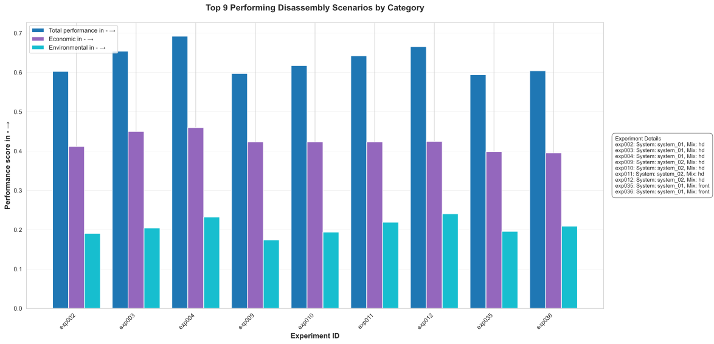
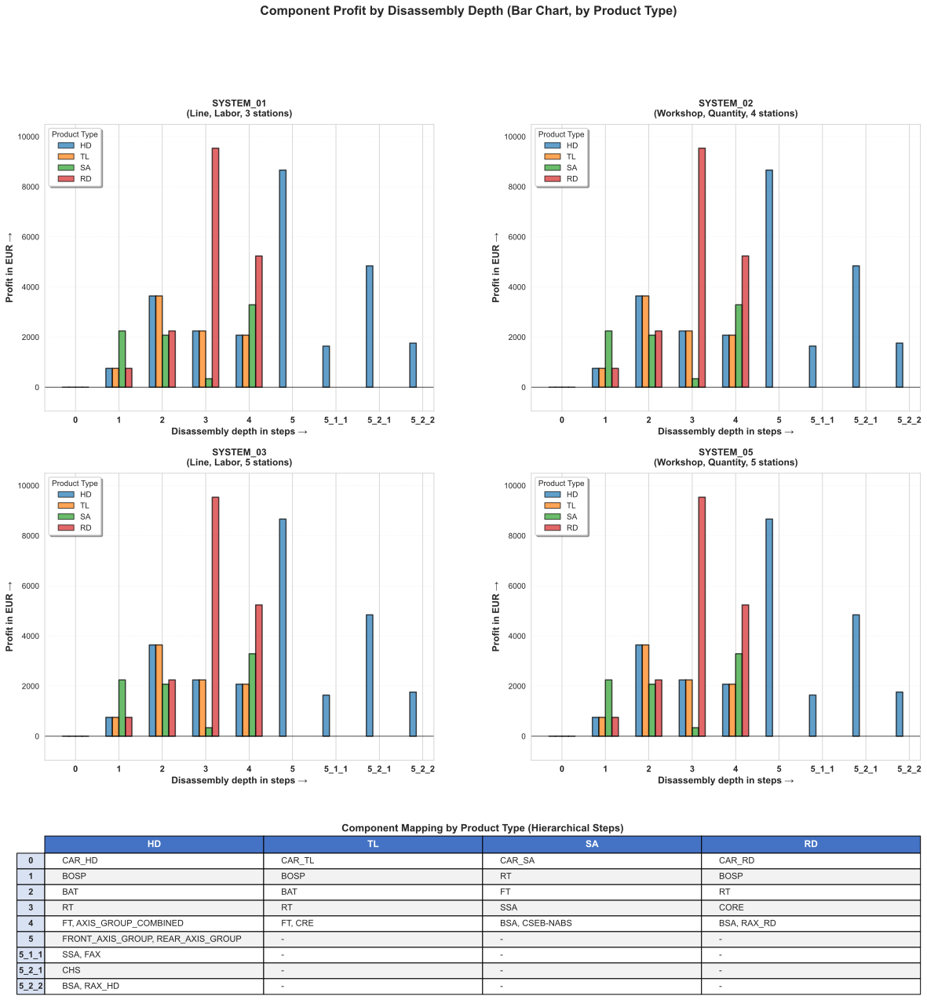
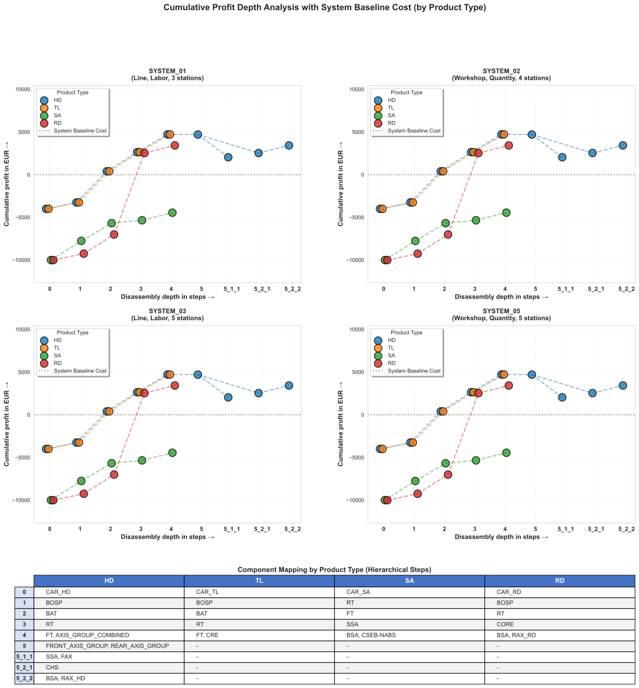
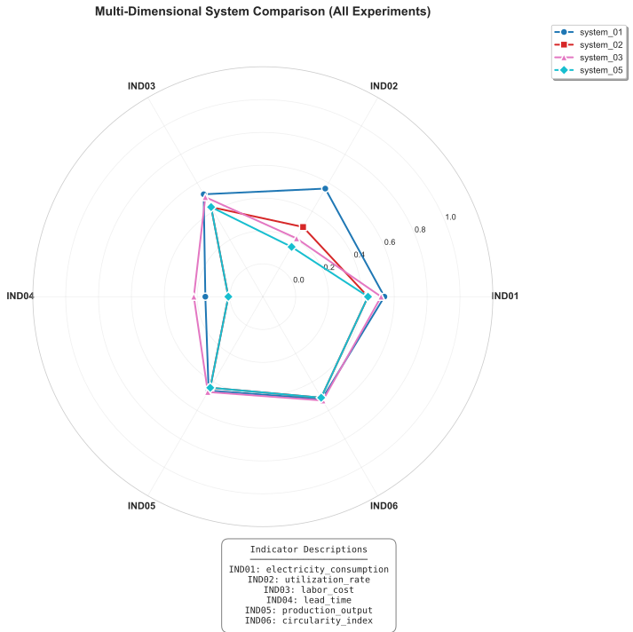
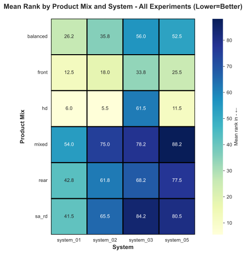
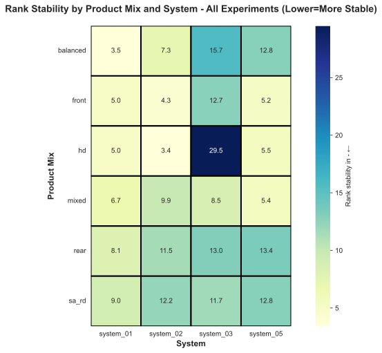
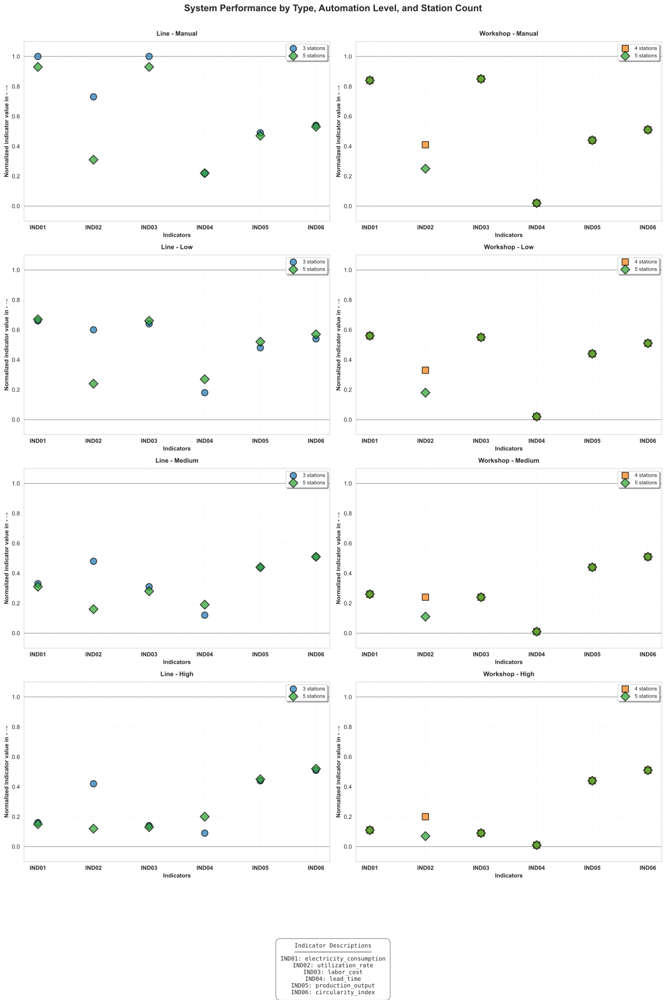
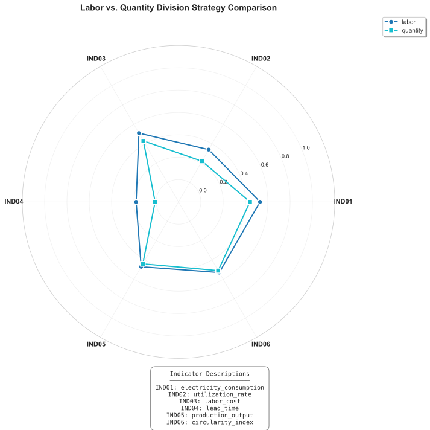

# Visualization Catalog
This document provides some examples of the generated visualizations, including some descriptions and interpretation tips.


> **🔬 Research software notice**: This document is part of a research prototype (v2025.11) and serves as implementation guidance. Scientific references are included for contextual understanding and further reading only. The peer-reviewed scientific contribution can only be found in the published article.


## Table of Contents
- [1. Overview](#1-overview)
- [2. Performance Rankings](#2-performance-rankings)
- [3. Disassembly Depth Analysis](#3-disassembly-depth-analysis)
- [4. Disassembly Scenario Comparison](#4-disassembly-scenario-comparison)
   - [4.1 Visualizations](#41-visualizations)
   - [4.2 Analytical Example: HD Portfolio in System 3](#42-analytical-example-hd-portfolio-in-system-3)
- [5. Multi-Factor Analysis](#5-multi-factor-analysis)
- [6. Distribution Analysis](#6-distribution-analysis)
- [7. Strategy Comparison](#7-strategy-comparison)
- [8. General Information](#8-general-information)


<br>

---

<br>

## 1. Overview
This document presents eight visualization examples of the current configuration. They are intended to demonstrate the analytical capabilities of the framework. The visualizations are configured in the configuration file [`config/config_visualizations.json`](../data/config/config_visualizations.json) and generated in the visualization output directory [`output/visualizations/`](../output/visualizations/).

**Note:** The visualizations FIG01 to FIG03 are generated but not documented here, as they are specifically formatted to fit the required format for the related scientific article.

<br>

---

<br>

## 2. Performance Rankings
Figure 2.1 presents the top nine performing disassembly scenarios, ranked by their total weighted score. Each experiment is displayed as a grouped bar chart, with three components: total performance (economic and environmental score), economic score, and environmental score. The legend provides the underlying system type and product mix for each experiment. This visualization can be used to identify which system-product configurations achieve the best overall performance and to understand whether economic or environmental factors dominate the ranking.

<div align="center">
  <figure>
    
    <br>
    <em><b>Fig. 2.1.</b> Top 9 performing disassembly scenarios by category (economic and environmental) [VIZ01]</em>
  </figure>
</div>

<br>

---

<br>


## 3. Disassembly Depth Analysis
Figure 3.1 presents the component-level profitability across disassembly steps, categorized by product type (HD, TL, SA, RD), and arranged based on the utilized disassembly system. The bar chart illustrates the profit contribution at each disassembly step, with separate bars indicating the performance of each product type. A positive bar indicates profitable components, while a negative bar indicates components where the disassembly costs exceed the recovery value. This visualization can be used to determine the optimal disassembly depth — the step beyond which further disassembly becomes less profitable. The divergent paths for HD products after step 5 are indicated by the sub-step numbering 5_1_1 and 5_2_1 (branches into 5_1 and 5_2 paths).

<div align="center">
  <figure>
    
    <br>
    <em><b>Fig. 3.1.</b> Component profit by disassembly depth for each product type [VIZ02]</em>
  </figure>
</div>

<br>

Figure 3.2 presents the cumulative profit curves, which illustrate the total profit as the disassembly depth increases. Each line in the chart represents a different product type, and the horizontal dashed line indicates the fixed system investment cost (baseline). The point at which a curve crosses the baseline represents the minimum disassembly depth required to cover the initial system investment and the costs for the acquisition of the returned product (break-even). This analysis can be used to identify which product types are most profitable at what disassembly depth and in what disassembly system. The divergent paths for HD products after step 5 are indicated by the sub-step numbering 5_1_1 and 5_2_1 (branches into 5_1 and 5_2 paths).

<div align="center">
  <figure>
    
    <br>
    <em><b>Fig. 3.2.</b> Cumulative profit by disassembly depth with system baseline cost for break-even analysis [VIZ03]</em>
  </figure>
</div>


<br>

---

<br>


## 4. Disassembly Scenario Comparison
### 4.1 Visualizations
Figure 4.1 presents a spider (radar) chart that compares the disassembly systems across six the normalized performance indicators IND01 to IND06. Each colored polygon in the graph represents the performance profile of a specific system. An expanded area indicates an enhanced overall performance. This visualization can be used to identify systems with a more balanced performance versus systems optimized for specific indicators.

<div align="center">
  <figure>
    
    <br>
    <em><b>Fig. 4.1.</b> Multi-dimensional system comparison across all 6 normalized indicators(group G01) [VIZ11]</em>
  </figure>
</div>

<br>

Figure 4.2 presents two heatmaps for the analysis of the disassembly scenarios, which are defined as the interaction between a system scenario and a product scenario. In Figure 4.2a, better mean rank performance is represented by lighter colors, which equal lower rank numbers. Figure 4.2b visualizes the performance stability measured by the standard deviation of the ranks. Lighter colors in the figure indicate a more consistent and robust performance across different configurations. These heatmaps can be used in combination to identify disassembly scenarios that balance the performance with the reliability. For instance, the product scenario "HD" with the system design "system_01" is light-colored in both heatmaps, indicating a robust and well-performing disassembly scenario.

<div align="center">
  <table>
    <tr>
      <td align="center" width="50%">
        <figure>
          
          <br>
          <em>a. Mean rank (lower=better)</em>
        </figure>
      </td>
      <td align="center" width="50%">
        <figure>
          
          <br>
          <em>b. Rank stability (lower=more stable)</em>
        </figure>
      </td>
    </tr>
  </table>
  <em><b>Fig. 4.2.</b> System × product mix interaction heatmaps showing performance and robustness (group G11 & G12) [VIZ12, VIZ13]</em>
</div>

<br>

### 4.2 Analytical Example: HD Portfolio in System 3
The heatmaps in Figure 4.2 reveal the interaction effects between the systems and the product scenarios. The **HD product mix** in **system_03** shows a mean rank of 61.5 and a standard deviation of 29.5; these values differ greatly from those of other HD-processing systems. This example illustrates how to interpret these visualizations by providing four key insights.

**Context:**
- System 3 is a 5-station line system with sequential disassembly processes
- HD products have the deepest disassembly depth, requiring all 5 workstations
- The four experiments (exp017 to exp020) vary only in their automation level (a00: manual, a02: low, a04: medium, a06: high)
- Performance ranks range from 33 (high automation, exp020) to 93 (low automation, exp018)

<br>

---

<br>

**Insight 1: WS-05 is a bottleneck workstation**<br>
System 3 has a structural imbalance, with the workstation WS-05 operating near its maximum capacity. IND02 displays an average utilization of 38.08% across all workstations (see [`M3_01_df_experiments_ranked_all.csv`](../output/dataframes/M3_01_df_experiments_ranked_all.csv)). However, the individual workstation analysis shows that WS-05 operates at 79.5% capacity, while WS-01 through WS-04 are only 20-30% utilized (see [`summary_stations_exp017.csv`](../data/processed/summary_stations_exp017.csv)).

Cause: The final workstation (ws-05) creates a bottleneck while upstream workstations have 70 to 80% idle time, constraining overall system performance.


<br>

**Insight 2: Automation level a04 represents a significant advancement**<br>
The high standard deviation (29.5) in Figure 4.2b results from a "rank jump" between manual/low automation (ranks 80 to 93) and medium/high automation (ranks 33 to 40). 

- ws-05 runtime: 3,340 min (a00) → 3,059 min (a02) → **2,638 min (a04)** → 2,624 min (a06)
- Processing time at a04 drops (see `car_hd_a02.json` vs `car_hd_a04.json`)
- Impact: exp019 (a04) achieves rank 40, while exp017 (a00) and exp018 (a02) remain at ranks 80-93

Cause: The automation level a04 represents a significant advancement, as it addresses the system constraint and suggests that automating ws-05 should be prioritized.

<br>


**Insight 3: Low automation worsens performance when bottleneck is ignored**<br>
Low automation (exp018, rank 93) performs worse than manual operation (exp017, rank 80). Automating ws-02 without addressing the ws-05 bottleneck can result in issues, which aligns with the previous insight 2:

- ws-02 runtime: 1,896 → 1,264 minutes (faster)
- ws-05 runtime: 3,340 → 3,059 minutes (reduced)
- Lead time: increases by 32% (3,224 → 4,252 minutes)
- Throughput: decreases by 4.6% (543 → 518 components)

Cause: The disassembly system was simulated as a pull system. The faster workstation ws-02 pulls more EOL products into the system while ws-05 cannot disassemble faster. Optimizing non-bottleneck workstations without addressing the constraint leads to an overall decline in performance.
<br>


**Insight 4: Bottleneck triggers multi-dimensional performance degradation**<br>
The bottleneck effects cascade through multiple indicators when comparing exp017 (manual) and exp018 (low automation):

- Lead time (IND04): 3,224 → 4,252 min (+32%)
- Utilization rate (IND02): 38.08% → 35.01% (-8%)
- Production output (IND05): 1,271,697 → 1,249,216 EUR (-1.8%)
- Circularity index (IND06): 49,575 → 48,843 kg (-1.5%)

Cause: The performance indicators are interdependent. As the bottleneck at WS-05 worsens, the utilization rate of the machines declines. As WS-05 functions as a bottleneck, fewer components are able to pass through the system. This results in a decrease in production output and the circularity index, which is calculated based on the production output.

<br>

---

## 5. Multi-Factor Analysis
Figure 5.1 presents a grid for analyzing a multi-dimensional group (system type × automation level × station count). The grid is organized with automation levels (manual, low, medium, high) as rows and system types (line vs. workshop) as columns. Within each cell, scatter points illustrate the performance across all six indicators (IND01 to IND06) for varying workstation counts (3, 4, and 5 workstations). This visualization could be used to analyze how a these three configuration dimensions interact.

<div align="center">
  <figure>
    
    <br>
    <em><b>Fig. 5.1.</b> Interaction analysis: system type, automation level, and station count (group G12) [VIZ14]</em>
  </figure>
</div>

<br>


## 6. Distribution Analysis
Figure 6.1 shows the boxplot distributions of all six indicators (IND01 to IND06) at four levels of automation (manual, low, medium, and high). This visualization can be used to analyze the effect of the degree of automation on the average value and variability of each indicator. As the example shows, the electricity consumption rises with the level of automation. This is reasonable, as the higher automation is enabled by a higher degree of electricity-powered tools.

<div align="center">
  <figure>
    
    <br>
    <em><b>Fig. 6.1.</b> Distribution of all six indicators across automation levels (group G03) [VIZ16]</em>
  </figure>
</div>

<br>


## 7. Strategy Comparison
Figure 7.1 compares the two division strategies (labor division vs. quantity division) using a spider chart format. This comparison can be used to analyze which division strategy performs better for specific indicators and whether one strategy offers a more balanced overall performance. The visualization could be used to determine whether to specialize workers on specific tasks (labor division) or to have workers handle complete products (quantity division).

<div align="center">
  <figure>
    
    <br>
    <em><b>Fig. 7.1</b> Labor division vs. quantity division strategy comparison (group G05) [VIZ18]</em>
  </figure>
</div>

<br>


## 8. General Information
The framework generates various visualization files, organized by their analytical purpose. Visualizations that incorporate multiple dimensions begin with two-digit numbers (VIZ11+).

**Performance rankings:**
- VIZ01: Top 9 performing scenarios with economic/environmental breakdown (`viz_01_top_scenarios.svg`) 
  

**Disassembly depth analysis:**
- VIZ02: Component profit by depth in bar chart format (`viz_02_product_depth_bars.svg`)
  
- VIZ02B: Component profit by depth in stacked bar chart format (`viz_02b_product_depth_stacked.svg`)
- VIZ03: Cumulative profit with system baseline for ROI analysis (`viz_03_cumulative_profit_curve.svg`)

**Disassembly scenario comparison:**
- VIZ11: Spider chart for multi-dimensional system comparison (`viz_11_G01_system_comparison.svg`)
- VIZ12: Heatmap for system × product mix mean performance (`viz_12_G11_performance_mean.svg`)
- VIZ13: Heatmap for system × product mix performance stability (`viz_13_G11_performance_stability.svg`)

**Multi-factor analysis:**
- VIZ14: Grid for system type × automation × station count in scatter format (`viz_14_G12_system_type_automation_grid.svg`)
- VIZ14B: Grid for system type × automation × station count in bar format (`viz_14b_G12_system_type_automation_grid_bars.svg`)

**Distribution analysis:**
- VIZ15: Boxplots for indicator distributions by number of stations (`viz_15_G06_station_boxplots.svg`)
- VIZ16: Boxplots for indicator distributions by automation level (`viz_16_G03_automation_boxplots.svg`)
- VIZ17: Boxplots for indicator distributions by product mix (`viz_17_G02_product_mix_boxplots.svg`)

**Strategy comparison:**
- VIZ18: Spider chart for labor vs. quantity division strategies (`viz_18_G05_division_comparison.svg`)


<br>


**Performance indicators (IND01 to IND06):**
All boxplot and spider chart visualizations use six normalized indicators (defined in `config_indicators.json`):
- **IND01** - Electricity consumption (kWh) - *minimize ←*
- **IND02** - Utilization rate (%) - *maximize →*
- **IND03** - Labor cost (EUR) - *minimize ←*
- **IND04** - Lead time (minutes) - *minimize ←*
- **IND05** - Production output (EUR) - *maximize →*
- **IND06** - Circularity index (kg) - *maximize →*


## Files Location

All generated visualizations are saved to:
```
output/visualizations/M6_XX_viz_YY_name.svg
```

where:
- `M6` = Module 6 (visualization module)
- `XX` = Sequential number (01-16)
- `viz_YY` = Visualization ID from config
- `name` = Descriptive filename
